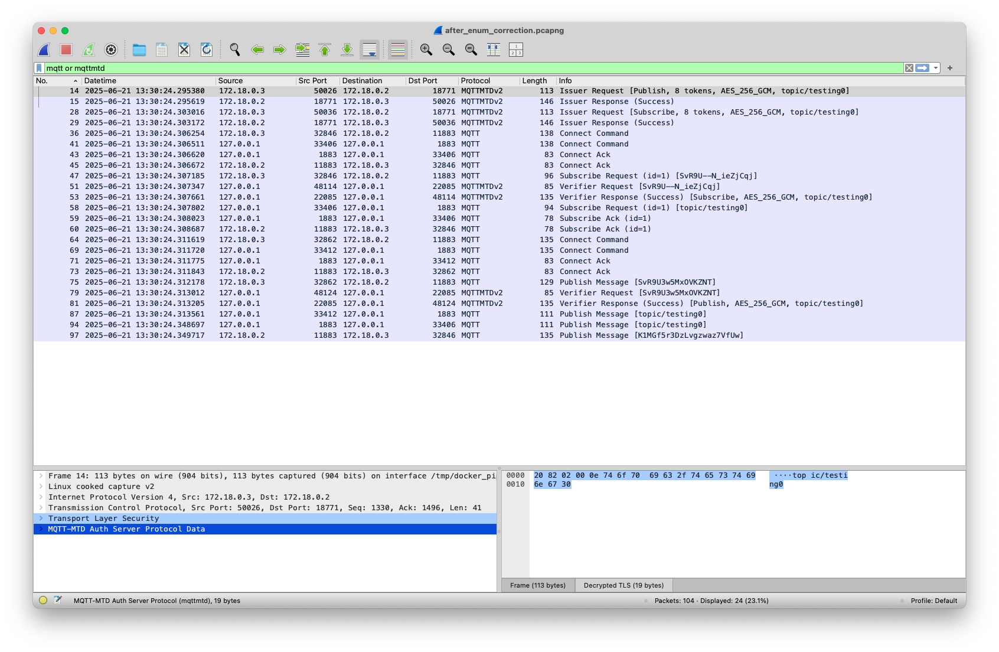

# MQTT-MTD

## Flows

### 1. Fetch tokens

Tokens are issued by the *Auth Server*. TLSv1.3 with a valid certificate is needed for the connection.
*Auth Server* checks the followings in addition to the optional client authentication:

- The first DNS SAN (Subject Alternative Name) has an entry in the ACL.
- The matched entry grants the combination of `topic` and `is_pub`

Request and response packet layouts are described below, in
the [Auth Server Packet Mapping](#auth-server-packet-mapping) section. The communication establishes a "**session**",
which
consists of a session key, a nonce padding and a timestamp.

### 2. Use tokens for client-to-server PUBLISH

#### 1. On client

Client must do the following calculations before constructing a PUBLISH packet:

- **Random** := HMAC-SHA256(Concat(`topic`|`token_idx`))\[0:6]
- **Token** := URLSafeB64Encode(Concat(`timestamp`|**Random**)).
- **Nonce** := Concat(`nonce_padding`, `0x0000`, `token_idx`). The length of `nonce_padding` must be (`algo.nonce_len` -
  4\) bytes.
- **Encrypted payload**: Encrypt(data=`payload`, nonce=**Nonce**). Tag is **postpended** to the ciphertext.

Now a PUBLISH packet \[topic=**Token**, payload=**Encrypted payload**] is ready to be sent to the server-side *MQTT
Interface*.

#### 2. On server

*MQTT Interface* verifies the token and decrypts the payload, following the above process reversely. Finally, *MQTT
Interface* sends out a decoded PUBLISH packet to the internal MQTT server.

### 3. Use tokens in a SUBSCRIBE context

#### 1. On client

Client must do the following calculations before constructing a SUBSCRIBE packet:

- **Random** := HMAC-SHA256(Concat(`topic`|`token_idx`))\[0:6]
- **Token** := Concat(`timestamp`|**Random**).

Now a SUBSCRIBE packet \[topic filter=**Token**] is ready to be sent to the server-side *MQTT
Interface*.

#### 2. On server

*MQTT Interface* verifies the token. Finally, *MQTT
Interface* sends out a decoded SUBSCRIBE packet to the internal MQTT server.

#### 3. When Server receives a matching PUBLISH packet

*MQTT Interface* do the following calculations before constructing a PUBLISH packet to Client:

- **Nonce** := Concat(`nonce_padding`, packet_id, `token_idx`). The length of `nonce_padding` must be (
  `algo.nonce_len` -
  4\) bytes.
- **Encrypted payload** and **Tag**: Encrypt(data=`payload`, nonce=**Nonce**).

Now a PUBLISH packet \[topic=URLSafeB64Encode(**Tag**), payload=**Encrypted payload**] is ready to be sent to Client.

## Auth Server Packet Mapping

[Wireshark Lua plugin @ `./wireshark`](wireshark/README.md) is written and available.

### Packet header

- bit 7-4: MQTT-MTD version (`0x2`)
- bit 3-0: Packet type
    - `0b0000`: Issuer request
    - `0b0001`: Issuer response
    - `0b0100`: Verifier request
    - `0b0101`: Verifier response

### AEAD algorithm

- `1`: AES_128_GCM
- `2`: AES_256_GCM
- `3`: CHACHA20_POLY1305

### Issuer

#### Request

| Index | Component | Sub component      | Length                  | Content                                                  |
|-------|-----------|--------------------|-------------------------|----------------------------------------------------------|
| 0     | Header    | -                  | 1 byte                  | `0x20`                                                   |
| 1     | Compound  |                    | 1 byte                  |                                                          |
|       |           | `is_pub`           | 1 bit                   | bit 7: On if requested for publish, otherwise subscribe. |
|       |           | `num_tokens_div_4` | 7 bits                  | bit 6-0: Requested number of tokens divided by 4.        |
| 2     | Algorithm | -                  | 1 byte                  | AEAD algorithm                                           |
| 3     | Topic     |                    | (2 + `topic_len`) bytes | Topic Name / Topic Filter                                |
|       |           | `topic_len`        | 2 bytes                 | Length of the topic in big endian.                       |
|       |           | `topic`            | `topic_len` bytes       | Topic Name / Topic Filter                                |

#### Response

| Index                           | Component      | Length                  | Content                                                                  |
|---------------------------------|----------------|-------------------------|--------------------------------------------------------------------------|
| 0                               | Header         | 1 byte                  | `0x21`                                                                   |
| 1                               | Status         | 1 byte                  | Issuance result.  - `0x01`: Success  - `0xFF`: Error             |
| 2                               | *Session key   | `key_len` bytes         | Secret key that is to be used for encryption and HMAC random generation. |
| 2 + `key_len`                   | *Nonce padding | (`nonce_len` - 4) bytes | Nonce padding that is to be used for constructing a nonce.               |
| 2 + `key_len` + `nonce_len` - 4 | *Timestamp     | 6 bytes                 | Timestamp that will be in tokens.                                        |

Components with * are present only when Status == `Success`

### Verifier

#### Request

| Index | Component | Length    | Content              |
|-------|-----------|-----------|----------------------|
| 0     | Header    | 1 byte    | `0x24`               |
| 1     | Token     | var bytes | Token to be checked. |

#### Response

| Index                       | Component    | Sub component | Length                  | Content                                                                                 |
|-----------------------------|--------------|---------------|-------------------------|-----------------------------------------------------------------------------------------|
| 0                           | Header       | -             | 1 byte                  | `0x25`                                                                                  |
| 1                           | Status       | -             | 1 byte                  | Verification result.  - `0x01`: Success  - `0x02`: Failure  - `0xFF`: Error |
| 2                           | *Compound    |               | 1 byte                  |                                                                                         |
|                             |              | `is_pub`      | 1 bit                   | bit 7: On if verified for publish, otherwise subscribe.                                 |
|                             |              | `algo`        | 7 bits                  | bit 6-0: AEAD algorithm                                                                 |
| 3                           | *Topic       |               | (2 + `topic_len`) bytes | Topic Name / Topic Filter                                                               |
|                             |              | `topic_len`   | 2 bytes                 | Length of the topic in big endian.                                                      |
|                             |              | `topic`       | `topic_len` bytes       | Topic Name / Topic Filter                                                               |
| 5 + `topic_len`             | *Session key | -             | `key_len` bytes         | Secret key that is to be used for encryption and HMAC random generation.                |
| 5 + `topic_len` + `key_len` | *Nonce       | -             | `nonce_len` bytes       | Nonce that is to be used for encryption.                                                |

Components with * are present only when Status == `Success`
